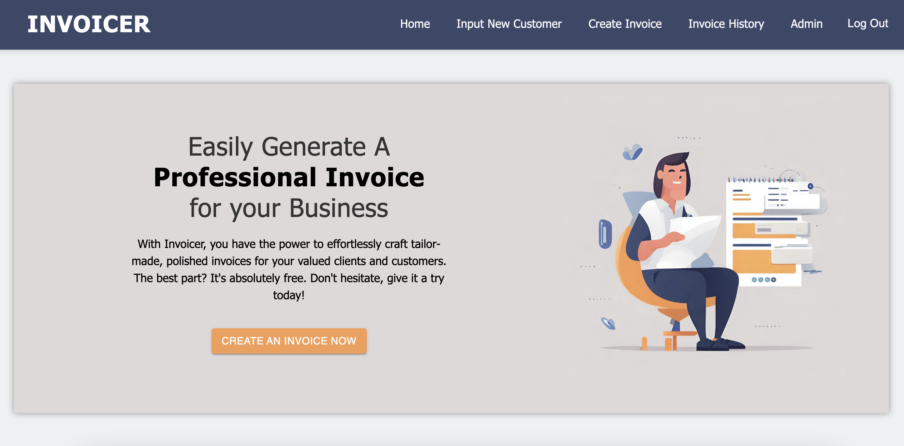
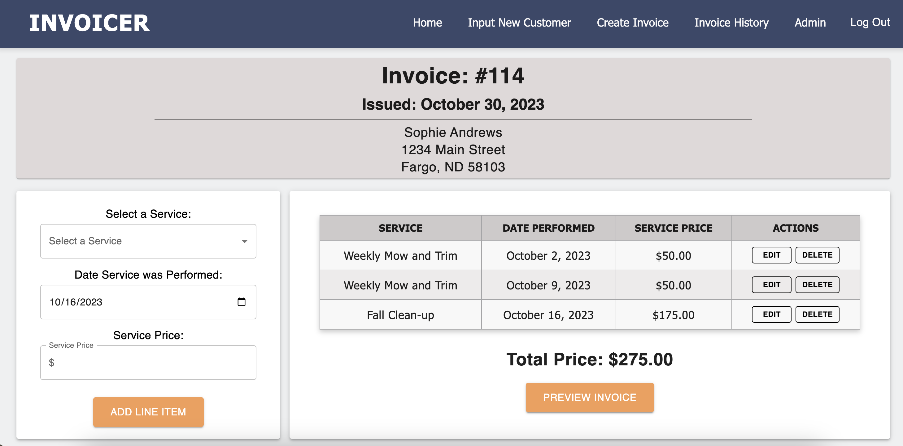
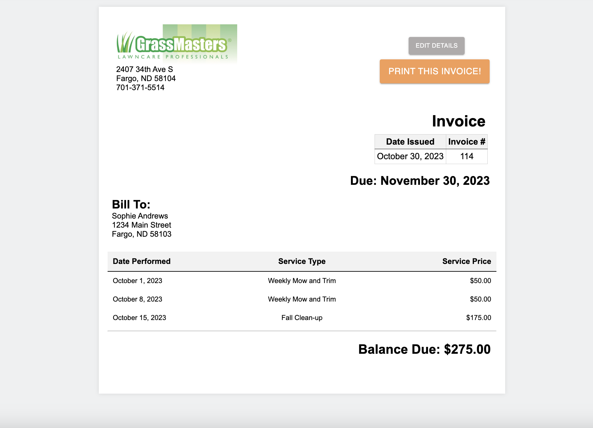
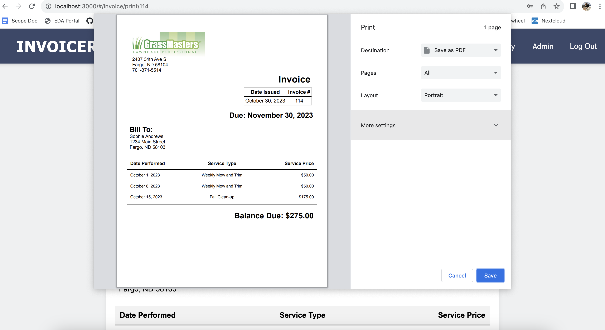
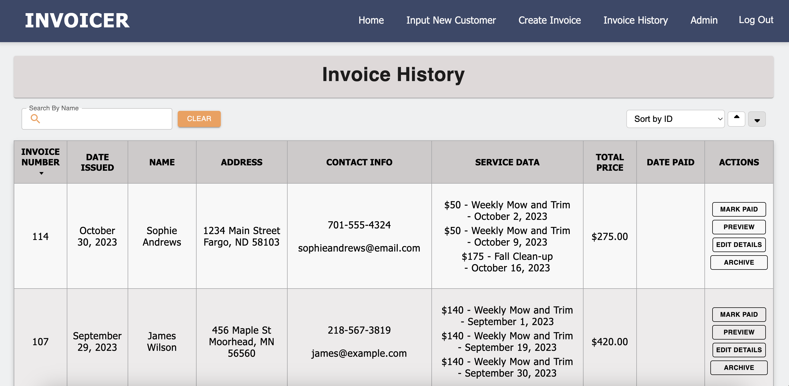

# Invoicer
Invoicer is my Solo Project from my time at Emerging Digital Academy. It is a business facing application that simplifies and streamlines the invoice generating process.

## Description
Invoicer is a simple alternative to generating invoices, aimed at small business owners or anyone that needs to create service based invoices. It offers customer management, service input, and takes that information to create a formatted printable invoice that can be customized with your company information. I was inspired to create this web application after seeing my mom struggle with complex invoicing programs while running our family lawn care business. I managed the company for a few years and knew the ins and outs of some of those more complicated programs and wanted to design something that was more user friendly and digestible for non technical users without sacrificing functionality.

### Duration
- 2 week sprint

### Prerequisites

Before you get started, make sure you have the following software installed on your computer:

- [Node.js](https://nodejs.org/en/)
- [PostrgeSQL](https://www.postgresql.org/)
- [Nodemon](https://nodemon.io/)

### Create database and table

- Create a new database called `prime_app` and use the queries in the database.sql file to set up your tables.
- If you would like to name your database something else, you will need to change `prime_app` to the name of your new database name in `server/modules/pool.js`

### Development Setup Instructions

- Run `npm install`
- Start postgres by using `brew services start postgresql`
- Run `npm run server`
- Run `npm run client`
- Navigate to `localhost:3000`

## Project Wireframes
I have attached a photo of my Landing Page, the Invoice Details Page, and the view of the generated invoice.

## Base User Usage

1. If database is setup and the app is running in browser you may login or look at the More Info page to learn more about the web application. Since registerring is not an option at this point a username that can be used is "alyssa" and password is "1234".
2. After logging in, the user can navigate to a Customer Input Form, Create Invoice Page, or the Invoice History page. 
3. To add a new customer to the database the user just navigates to that page and fills out the input form.
4. To create an invoice, you are brought to a form to select a customer and a date to issue the invoice. Once selected it brings you to the Invoice Details view where you can see all the invoice and customer details and add services with date performed and price for each service. 
5. Once all the invoice line items are inputted, you can edit or delete them if you need to make any changes, then you can preview your invoice.
6. After the invoice has been created it is automatically added into the invoice history table.
7. The invoice history page has a fuzzy search option, and various sorting features to more easily access certain invoices that may be sought out.
8. In the invoice history table there are options to mark the invoice as paid, edit the invoice details, preview the printable invoice. Only the Admin has access to archive invoices.
9. This completes the base user functionality.

## Admin Usage

1. The Admin user has all the same features as the base user but they have access to the Admin page which has some added features.
2. Admin is the only user that can archive invoices on the invoice history table as well.
3. The Admin page has a main page that has a financial overview of the month by month invoice amount using reach charts.
4. From that page there is its own seperate navbar that can be accessed using a hamburger menu and that has links to Service, Customer, Employee, Company, and Archvied Invoices pages.
5. The services page has the capibility to add a new service as well as delete services.
6. The customers page has the same fuzzy search as the invoice history page, as well as the ability to edit every piece of customer information, to add new customers, and archive old customers.
7. There is a button on the customers page to bring you to the archvied customers table as well and there is an option to "un-archive" the customers in case you start servicing them again.
8. The employee page has the ability to add new employees (passwords are all encrypted) and delete old employees.
9. The Company page has an input form to add your company's information and that is what populates in the printable invoice page.
10. The last page is the archived invoice page which just shows which invoices have been archived. There is a search and sort feature on that page but no actions to edit or un-archive.

### Built With

 - HTML
 - CSS
 - Javascript
 - ReactJS
 - Redux/ Sagas
 - Axios
 - Express.js
 - PostgresSQL
 - Postico
 - Postman
 - Git
 - Bcrypt.js
 - Passport.js
 - React Charts
 - Fuse.js
 - SweetAlert2
 - Material UI

### Acknowledgement

Thanks to [Emerging Digital Academy](http://www.emergingacademy.org) who equipped and helped me to make this application a reality. It will be something that I implement in my small business and I hope to keep developing to make a customer-facing application as well.
Also, a huge thanks to my cohort mates, we all leaned on each other and helped each other through these projects and I'm grateful to have gone through this process with you.

### Support

If you have suggestions or issues, please email me at [alyssa.s.nichols94@gmail.com](mailto:alyssa.s.nichols94@gmail.com)
